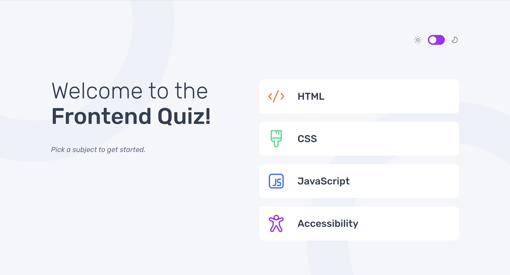

# Frontend Mentor - Frontend quiz app solution

This is a solution to the [Frontend quiz app challenge on Frontend Mentor](https://www.frontendmentor.io/challenges/frontend-quiz-app-BE7xkzXQnU). Frontend Mentor challenges help you improve your coding skills by building realistic projects.

## Table of contents

-   [Overview](#overview)
    -   [The challenge](#the-challenge)
    -   [Screenshot](#screenshot)
    -   [Links](#links)
-   [My process](#my-process)
    -   [Built with](#built-with)
    -   [What I learned](#what-i-learned)
    -   [Continued development](#continued-development)
    -   [Useful resources](#useful-resources)
-   [Author](#author)

## Overview

### The challenge

Users should be able to:

-   Select a quiz subject
-   Select a single answer from each question from a choice of four
-   See an error message when trying to submit an answer without making a selection
-   See if they have made a correct or incorrect choice when they submit an answer
-   Move on to the next question after seeing the question result
-   See a completed state with the score after the final question
-   Play again to choose another subject
-   View the optimal layout for the interface depending on their device's screen size
-   See hover and focus states for all interactive elements on the page
-   Navigate the entire app only using their keyboard
-   **Bonus**: Change the app's theme between light and dark

### Screenshot



### Links

-   Solution URL: [Solution URL](https://github.com/Joshk7/frontend-quiz)
-   Live Site URL: [Live Site URL](https://frontend-quiz-three.vercel.app)

## My process

### Built with

-   Semantic HTML5 markup
-   CSS custom properties
-   Flexbox
-   CSS Grid
-   Mobile-first workflow

### What I learned

I gained more experience working with asynchronous JavaScript using the fetch api to initially grab the quiz data that populates the website:

```js
const fetchData = async () => {
    try {
        const response = await fetch("/data.json");
        if (!response.ok) {
            throw new Error("Unable to fetch data");
        }
        const result = await response.json();
        quizzes = result.quizzes;
        renderQuizzes();
    } catch (error) {
        menuList.innerHTML = `<li class="fetch__error">${error.message}</li>`;
    }
};
```

Additionally, I learned how to use css variables to make switching between themes easier. All I had to do was ensure that I use a variable for colors that switch for different themes:

```css
:root {
    --primary: var(--light-grey);
    --primary-accent: var(--pure-white);
    --secondary: var(--dark-navy);
    --secondary-accent: var(--grey-navy);
}
```

Then I added a dark class for dark theme having light as default.

```css
.dark {
    --primary: var(--dark-navy);
    --primary-accent: var(--navy);
    --secondary: var(--pure-white);
    --secondary-accent: var(--light-bluish);
}
```

Once that was all setup, the event handler for the theme toggle button was simple. I just had to toggle the dark class.

```js
const handleThemeClick = (e) => {
    root.classList.toggle("dark");
};
```

### Useful resources

-   [How to make a simple JavaScript Quiz](https://www.geeksforgeeks.org/how-to-create-a-simple-javascript-quiz/) - This really helped me get started with the layout of my JavaScript file because I was a little overwhelmed with where to start.

## Author

-   Website - [Joshua Kahlbaugh](https://www.your-site.com)
-   Frontend Mentor - [@Joshk7](https://www.frontendmentor.io/profile/Joshk7)
